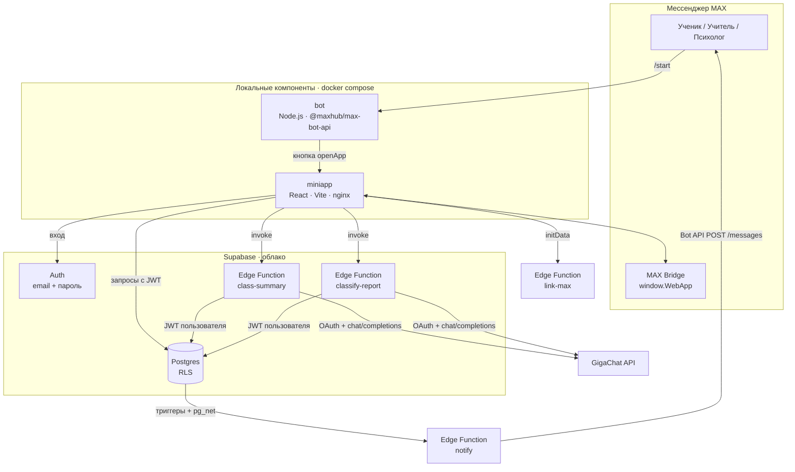
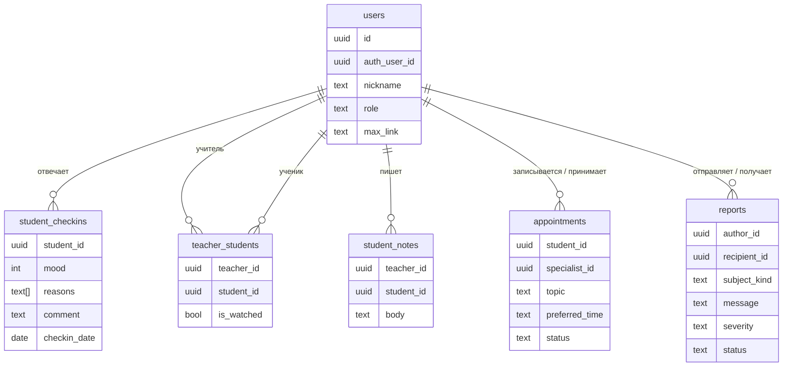

# Архитектура ClassPulse

## Компоненты



| Компонент | Ответственность | Не делает |
|---|---|---|
| Бот | Встречает пользователя, открывает мини-приложение, `/help` с экстренными контактами | Не хранит данные, не обращается к базе |
| Мини-приложение | Весь интерфейс, бизнес-правила отображения (состояние ученика, сортировка) | Не хранит секреты; ключи Supabase в нём публичные |
| Supabase Postgres | Данные и **права доступа** (RLS + привилегии колонок) | — |
| Edge Functions | Единственное место с ключами GigaChat и бота; обезличивание перед LLM; привязка MAX и уведомления | `class-summary` и `classify-report` работают с JWT пользователя и не обходят RLS; сервисный ключ — только в `link-max` (одна колонка) и `notify` (чтение получателей) |
| GigaChat | Сводка текста, оценка срочности | Не получает имён и идентификаторов |

## Структура кода

```text
miniapp/src/
├── api/            # доступ к данным: users, auth, checkins, students, support, ai
├── features/
│   ├── auth/       # вход и регистрация
│   ├── student/    # опрос-чат, поддержка, формы записи и жалобы
│   ├── teacher/    # класс, сводка, карточка ученика, история оценок
│   ├── inbox/      # обращения для учителя и психолога
│   ├── shared/     # профиль, выбор человека, логотип
│   └── RoleApps.tsx  # вкладки для каждой роли
├── hooks/useLoader.ts  # загрузка данных с состоянием и ошибкой
├── lib/            # max.ts (MAX Bridge), mood.ts (правило состояния), date.ts, labels.ts, errors.ts
├── ui/             # UI-кит: Cell, Section, Button, Sheet, TabBar, Avatar, Badge…
└── styles/         # tokens.css (светлая/тёмная тема), base, ui, screens

supabase/
├── schema.sql
└── functions/
    ├── _shared/    # http.ts (CORS, ошибки), auth.ts (контекст пользователя), gigachat.ts, ca.ts, date.ts
    ├── class-summary/
    └── classify-report/
```

Слои зависят только сверху вниз: `features → api → lib`, `features → ui`. Компоненты UI не знают о данных.

## Модель данных



Ограничения на уровне базы: один ответ ученика в день (`unique(student_id, checkin_date)`), оценка 1–5,
длины текстов, допустимые статусы и роли, ссылка MAX только вида `https://max.ru/...`.

## Права доступа

| Действие | Ученик | Учитель | Психолог |
|---|---|---|---|
| Свои ответы: читать / создавать / менять | ✓ | — | — |
| Ответы учеников своего класса | — | читать | — |
| Состав класса, «на контроле» | видит свои связи | управляет своим классом | — |
| Заметки | — | только свои | — |
| Запись на разговор | создать, видеть свои | видеть и менять статус адресованных ему | то же |
| Жалоба | создать, видеть свои | видеть адресованные ему **без автора**, менять статус | то же |

Анонимность жалоб: `author_id` заполняется на сервере (`default private.current_profile_id()`), клиенту
не выдано право вставлять или читать эту колонку (`grant select (...)` без `author_id`). Проверено на
локальном PostgreSQL: запрос `select author_id from reports` от получателя возвращает `permission denied`.

## Потоки данных

**Опрос.** Мини-приложение → вставка или обновление ответа за сегодня в `student_checkins` с JWT ученика → RLS проверяет, что это его профиль.

**Сводка класса.** Мини-приложение → `class-summary` (JWT) → функция проверяет роль «учитель», читает
сегодняшние ответы только его учеников → отправляет в GigaChat массив `{mood, reasons, comment}` без имён →
возвращает Markdown → мини-приложение показывает. В базе сводка не сохраняется.

**Жалоба.** Мини-приложение → `classify-report` (текст) → GigaChat возвращает `low|medium|high|critical`
(при ошибке — `medium`) → вставка в `reports` с JWT ученика.

**Привязка MAX.** Внутри MAX мини-приложение отправляет `window.WebApp.initData` в `link-max`. Функция
проверяет подпись (HMAC-SHA256: ключ `HMAC("WebAppData", токен бота)`, строка — отсортированные пары
`key=value` без `hash`) и свежесть `auth_date` (1 час), затем через закрытую для клиентов SQL-функцию
атомарно переносит привязку и записывает `max_user_id`. Дубли параметров, даты из будущего и неверные id отклоняются.
Клиент не может записать эту колонку сам и не может её прочитать — видит только флаг `max_linked`.

**Уведомления.** Триггеры на `student_checkins` (оценка 1–2), `appointments` (новая запись, смена статуса)
и `reports` (новая жалоба, жалоба решена) через `pg_net` отправляют изменение в `notify` с заголовком
HMAC-SHA256. В очереди находятся только id события/записи и статус, без секрета и автора жалобы.
Функция атомарно отмечает событие доставляемым (повторный запрос пропускается), читает запись серверным
ключом, находит получателей и шлёт сообщение ботом с кнопкой «Открыть ClassPulse».
Пока в `private.app_config` нет адреса и секрета, триггеры ничего не делают; ошибка отправки не мешает
сохранению данных.

**MAX.** `max.ready()` при старте; `HapticFeedback` на действиях; `BackButton` закрывает шторки;
`openMaxLink` открывает профиль собеседника; `shareMaxContent` отправляет приглашение в чат класса; `initDataUnsafe.user.first_name` подставляется в регистрацию.

## Обработка ошибок

- Все запросы идут через `unwrap()`; ошибки переводятся в понятный текст (`lib/errors.ts`) и показываются
  баннером рядом с действием; кнопки показывают загрузку и блокируются на время запроса.
- Edge Functions возвращают `{ error }` с кодом 4xx/5xx; тайм-ауты GigaChat — 15 с (OAuth) и 45 с (ответ).
- Ошибка одного блока (например, сводки) не ломает экран; повторить можно той же кнопкой без перезагрузки.

## Безопасность

- Секреты (`BOT_TOKEN`, `GIGACHAT_AUTH_KEY`, `SUPABASE_SERVICE_ROLE_KEY`) не в коде: `.env` в `.gitignore`,
  ключ GigaChat — в секретах Supabase.
- В браузере только публичный ключ Supabase; доступ ограничивает RLS.
- Запросы к GigaChat идут с сертификатами НУЦ Минцифры (`_shared/ca.ts`).
- Промпты явно указывают модели, что ответы учеников — данные, а не инструкции (защита от prompt injection).
