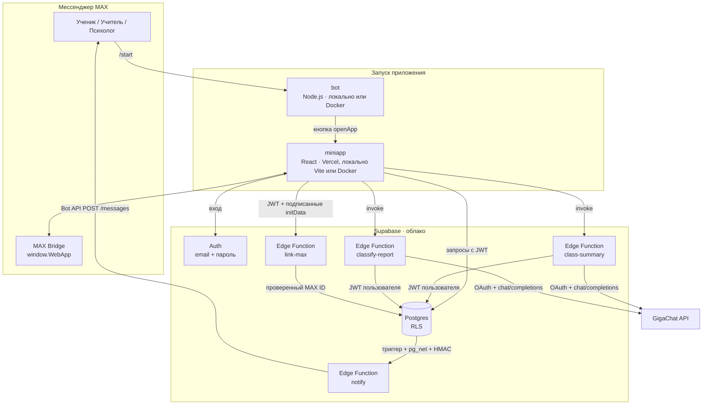

# Архитектура ClassPulse

## Компоненты



| Компонент | Ответственность | Не делает |
|---|---|---|
| Бот | Встречает пользователя, открывает мини-приложение полной ссылкой на бота, `/help` с экстренными контактами | Не хранит данные, не обращается к базе |
| Мини-приложение | Весь интерфейс, бизнес-правила отображения (состояние ученика, сортировка) | Не хранит секреты; ключи Supabase в нём публичные |
| Supabase Postgres | Данные и **права доступа** (RLS + привилегии колонок) | — |
| Edge Functions | Ключи GigaChat и бота, обезличивание перед LLM, проверенная привязка MAX и уведомления | `class-summary` и `classify-report` работают с JWT пользователя и не обходят RLS; сервисный ключ используют только `link-max` и `notify` |
| GigaChat | Сводка текста, оценка срочности | Не получает имён и идентификаторов |

Для локального запуска `compose.yaml` собирает два контейнера из `miniapp/Dockerfile` и
`bot/Dockerfile`; облачные Postgres, Auth и Edge Functions остаются в Supabase. Контейнер
miniapp раздаёт готовую сборку через nginx. При старте он создаёт `config.js` из публичных
переменных Supabase, поэтому образ не зависит от конкретного проекта. Браузер загружает
`config.js` перед кодом React; при запуске через Vite или Vercel приложение использует
переменные сборки. Токен бота передаётся только в окружение контейнера bot, без записи в образ.
GitHub Actions собирает эти же Dockerfile и публикует два образа в GHCR.

## Структура кода

```text
miniapp/src/
├── api/            # доступ к данным: users, auth, checkins, students, support, ai, max
├── features/
│   ├── auth/       # вход и регистрация
│   ├── student/    # опрос-чат, поддержка, формы записи и жалобы
│   ├── teacher/    # класс, сводка, карточка ученика, история оценок
│   ├── inbox/      # обращения для учителя и психолога
│   ├── shared/     # профиль, выбор человека, логотип
│   └── RoleApps.tsx  # вкладки для каждой роли
├── hooks/useLoader.ts  # загрузка данных с состоянием и ошибкой
├── lib/            # max.ts (MAX Bridge), mood.ts (правило состояния), date.ts, labels.ts, errors.ts
├── ui/             # UI-кит: Cell, Section, Button, Sheet, TabBar, Avatar, Badge…
└── styles/         # tokens.css (светлая/тёмная тема), base, ui, screens

supabase/
├── schema.sql
├── tests/          # RLS, обновление прежней схемы, подписи уведомлений
└── functions/
    ├── _shared/    # HTTP, JWT, GigaChat, MAX, сертификаты и даты
    ├── class-summary/
    ├── classify-report/
    ├── link-max/
    └── notify/

bot/src/             # команды MAX и кнопка запуска
bot/run.mjs          # запуск с доверенными сертификатами MAX API v2
```

Слои зависят только сверху вниз: `features → api → lib`, `features → ui`. Компоненты UI не знают о данных.

## Модель данных

Это фактическая схема подключённого проекта Supabase `qlfxuganauqcbtczinwk`, сверенная с БД
30.09.2026. `auth.users` хранит учётные данные, а `public.users` — профиль приложения.

| Таблица | Поля и связи, используемые приложением |
|---|---|
| `public.users` | `id` UUID; `auth_user_id` → `auth.users.id`; `nickname`, `role` (`student` / `teacher` / `psychologist`), `max_link`, закрытый `max_user_id`, вычисляемый `max_linked`, `created_at` |
| `public.student_checkins` | `id`; `student_id` → `users.id`; `mood` 1–5, `reasons` text[], `comment`, `checkin_date` (день по Москве), `created_at` |
| `public.teacher_students` | `id`; `teacher_id` и `student_id` → `users.id`; `is_watched`, `created_at`; пара учитель–ученик уникальна |
| `public.student_notes` | `id`; `teacher_id` и `student_id` → `users.id`; `body`, `created_at` |
| `public.appointments` | `id`; `student_id` и `specialist_id` → `users.id`; `topic`, `preferred_time`, `status` (`new` / `accepted` / `declined` / `done`), `created_at` |
| `public.reports` | `id`; закрытый `author_id` и `recipient_id` → `users.id`; `subject_kind`, `subject_name`, `message`, `severity` (`low` / `medium` / `high` / `critical`), `status` (`new` / `read` / `resolved`), `created_at` |
| `private.app_config` | `key`, `value`: адрес функции уведомлений и серверный секрет; клиенту недоступна |
| `private.notification_events` | `id`, `created_at`, `claimed`: однократное принятие события; клиенту недоступна |

Все прикладные `id` — UUID. Ограничения базы проверяют роли, допустимые статусы, длины текстов и
ссылку MAX вида `https://max.ru/...`. Индекс `(student_id, checkin_date)` не допускает двух
датированных ответов ученика за один день. Старые ответы без даты сохранены после миграции,
но не считаются ответом за сегодня. При удалении профиля связанные записи удаляются по FK.

На момент сверки в этом проекте было 12 профилей (8 учеников, 3 учителя, 1 психолог),
12 ответов, 8 связей класса, 3 записи на разговор, 2 жалобы и 0 заметок. Это состав всей
рабочей базы, а не набор из трёх выбранных тестовых аккаунтов в [TESTING.md](TESTING.md).
Демонстрационный `seed` для этой проверки не нужен. Таблица `public.student_requests`
оставлена от первой версии, но текущий интерфейс использует `appointments` и `reports`.

## Права доступа

| Действие | Ученик | Учитель | Психолог |
|---|---|---|---|
| Свои ответы: читать / создавать / менять | ✓ | — | — |
| Ответы учеников своего класса | — | читать | — |
| Состав класса, «на контроле» | видит свои связи | управляет своим классом | — |
| Заметки | — | только свои | — |
| Запись на разговор | создать, видеть свои | видеть и менять статус адресованных ему | то же |
| Жалоба | создать, видеть свои | видеть адресованные ему **без автора**, менять статус | то же |

Анонимность жалоб: `author_id` заполняется на сервере (`default private.current_profile_id()`), клиенту
не выдано право вставлять или читать эту колонку (`grant select (...)` без `author_id`). Проверено на
локальном PostgreSQL: запрос `select author_id from reports` от получателя возвращает `permission denied`.

## Потоки данных

**Опрос.** Мини-приложение → вставка или обновление ответа за сегодня в `student_checkins` с JWT ученика → RLS проверяет, что это его профиль.

**Сводка класса.** Мини-приложение → `class-summary` (JWT) → функция проверяет роль «учитель», читает
сегодняшние ответы только его учеников → отправляет в GigaChat массив `{mood, reasons, comment}` без имён →
возвращает Markdown → мини-приложение показывает. В базе сводка не сохраняется.

**Жалоба.** Мини-приложение → `classify-report` (текст) → GigaChat возвращает `low|medium|high|critical`
(при ошибке — `medium`) → вставка в `reports` с JWT ученика.

**Привязка MAX.** Внутри MAX мини-приложение отправляет `window.WebApp.initData` в `link-max`. Функция
проверяет подпись (HMAC-SHA256: ключ `HMAC("WebAppData", токен бота)`, строка — отсортированные пары
`key=value` без `hash`) и свежесть `auth_date` (1 час), затем через закрытую для клиентов SQL-функцию
атомарно переносит привязку и записывает `max_user_id`. Дубли параметров, даты из будущего и неверные id отклоняются.
Клиент не может записать эту колонку сам и не может её прочитать — видит только флаг `max_linked`.

**Уведомления.** Триггеры на `student_checkins` (оценка 1–2), `appointments` (новая запись, смена статуса)
и `reports` (новая жалоба, жалоба решена) через `pg_net` отправляют в `notify` тело с минимальными
полями события и подписью HMAC-SHA256. В очереди находятся только id события/записи, оценка или статус;
там нет секрета, автора жалобы и свободного текста.
Функция атомарно отмечает событие доставляемым (повторный запрос пропускается), читает запись серверным
ключом, находит получателей и шлёт сообщение ботом с кнопкой «Открыть ClassPulse».
Пока в `private.app_config` нет адреса и секрета, триггеры ничего не делают; ошибка отправки не мешает
сохранению данных.

**MAX.** `max.ready()` при старте; `HapticFeedback` на действиях; `BackButton` закрывает шторки;
`openMaxLink` открывает профиль собеседника; `shareMaxContent` отправляет приглашение в чат класса; `initDataUnsafe.user.first_name` подставляется в регистрацию.

## Обработка ошибок

- Все запросы идут через `unwrap()`; ошибки переводятся в понятный текст (`lib/errors.ts`) и показываются
  баннером рядом с действием; кнопки показывают загрузку и блокируются на время запроса.
- Edge Functions возвращают `{ error }` с кодом 4xx/5xx; тайм-ауты GigaChat — 15 с (OAuth) и 45 с (ответ).
- Ошибка одного блока (например, сводки) не ломает экран; повторить можно той же кнопкой без перезагрузки.

## Безопасность

- Секреты (`BOT_TOKEN` локального бота, `MAX_BOT_TOKEN`, `NOTIFY_SECRET`, `GIGACHAT_AUTH_KEY`
  и `SUPABASE_SERVICE_ROLE_KEY` функций) не в коде: `.env` в `.gitignore`, ключи функций —
  в секретах Supabase.
- В браузере только публичный ключ Supabase; доступ ограничивает RLS.
- Запросы к GigaChat идут с сертификатами НУЦ Минцифры (`_shared/ca.ts`).
- Промпты явно указывают модели, что ответы учеников — данные, а не инструкции (защита от prompt injection).
